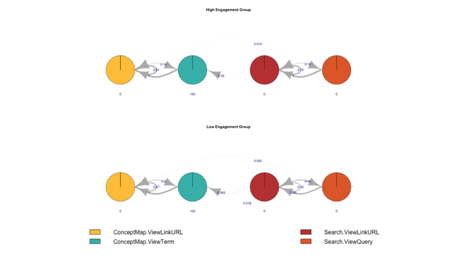
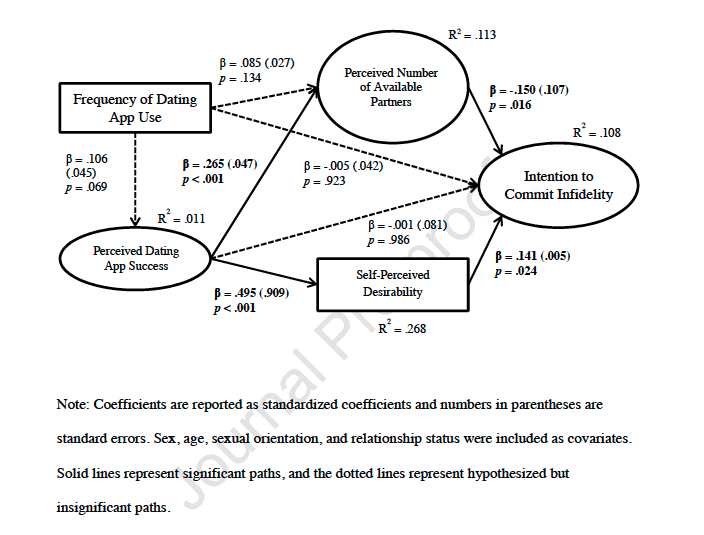
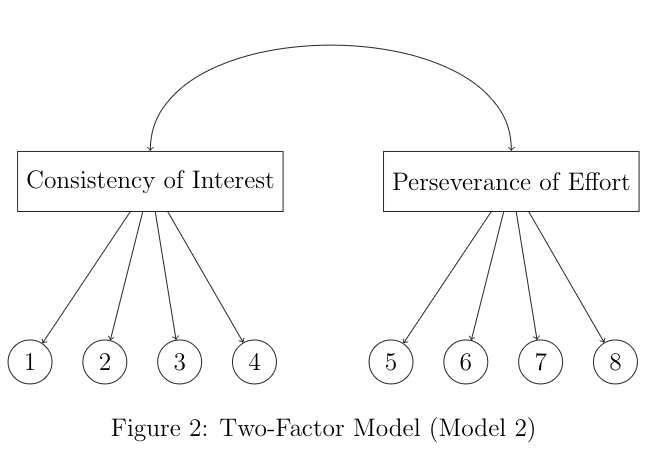

class: overview-slide

.overview-text[Outline]

---

class: phd-overview

.phd-text[PhD Work]

---

<div style = 'position: absolute; left: 700px; margin-top: 50px'>
  
</div>

```{r, echo=FALSE, fig.height=20, fig.width=10, fig.align='center', out.height=650}
library(DiagrammeR)
mermaid("
        graph LR
        
        A((Political Context))
        B((Stakeholders))
        C((Behaviour Change))
        D((Engagement Strategy))
        E((Internal Capacity))
        F((Monitoring Framework))
        
        style A fill:white; style B fill:white; style C fill:white; 
        style D fill:white; style E fill:white; style F fill:white; 
        
        A-->B
        B-->C
        C-->D
        D-->E
        E-->F
        F-->A
        ")

```

---

```{r,echo=FALSE,fig.align='center',out.height=600, out.width=600}
library(leaflet)

selaqLocations <- data.frame(location = c('Edinburgh', 'Liverpool', 'Blanchardstown',
                                          'Netherlands', 'Germany', 'Estonia',
                                          'Madrid', 'Chile', 'Ecuador',
                                          'Brazil'),
                             longitude = c(-3.2753778, -3.0561397, -6.3917114,
                                           4.1584696, 5.9695845, 23.8112948,
                                           -3.8196192, -70.7699146, -80.0499017,
                                           -46.8754845),
                             latitude = c(55.9411885, 53.4120954, 53.3873948,
                                          52.2076821, 51.0899702, 58.615534,
                                          40.4378698, -33.4727092, -2.1523858,
                                          -23.6821604))

leaflet(selaqLocations) %>% 
  addProviderTiles(providers$Stamen.Watercolor) %>% 
  addMarkers(~longitude, ~latitude, popup = ~as.character(location))

```


---

class: current-work

.current-work-text[Current Research]

---

<div style = "position:absolute; left:-40px;top:50px">
  
</div>

---

class: quest-slide

.questPsych[Questionable Psychology]

---

<div>
  
</div>

Alexopoulos, C., & McNallie, J. (2019). Swiping more, committing less: Unraveling the links among dating app use, dating
app success, and intention to commit infidelity. Computers in Human Behaviour.

---
.pull-left[
Claim: Not the frequency of use, but perceived success.

Issues:

- 44.60% were undergraduates.

- 36.50% of the sample were single.

- Only those using a dating app.

- Perception based measures - social desirability.

]


---

class: grit-slide

.grit-text[Grit]

---

class: grit-textTwo

.grit-points[


- Perseverance of Effort

- Consistency of Interests

- Positive indicator of long-term success

- Ted Talk views (30/08/2019): 17,793,987

- Grit workshops (Prices from $1600): 

<a style='margin-left:60px' href = "http://www.wundertraining.com.au/workshops/resilience-grit"> Grit Workshop </a>


]


.pull-right[

<div style = "position:absolute; left:550px; top: 125px">
  
</div>
]

---

# Contradictory Findings


<div style = "position:relative; left:150px; top:-10px">
  
</div>


Whitelock-Wainwright, A., & Gasevic, D. Artifacts and the Grit Scale.
---

class:measureMatters

.mm-text[Measurement Matters]

---

###Survey Design, Development, and Validation

- Purpose

- Define domain

- Pre-existing measures?

- Item format

- Item pool

- Review

- Pilot

- Analyse

- Revise

- Validate

- Guidelines

<div style = 'position:absolute;left:400px;top:200px'>

</div>
---

## Purpose and Definition

- Why is it being developed?

- What is in and out of scope?

- Definition of the construct (continuum?).

- Delineate definition from other perspectives.

- Narrow or general construct? E.g., Self-concepts

- Population? (Adults, children, age, etc.)

---

Define Intelligence

---

## Jingle Jangle Fallacies

- Similar measures?

- Jingle: Same scale names $\neq$ same construct

- Jangle: Different scale names $\neq$ different constructs (Grit and Conscientiousness)

---

## Item Creation

- Don't refer to the past -> memory and age

- Avoid factual statements - 'Theft is illegal'

- Avoid irrelevant attitudes - Live streaming & Reading lists

- Avoid skewed items (most of the time)

- Clear language and simple statements

- $\leq$ 20 words

- Avoid 'double-barreled' items - I like wine and cheese

- Avoid negatively phrased items - I do not like live streaming

---

## Next Steps

---

Factor Analysis

---

- Latent variables measured by manifest measures

- $X_{1}$ = $\alpha_{11}f_{1}$ + $\alpha_{12}f_{2}$ + $...$ + $\alpha_{1m}f_{m}$ + $u_{1}$

- Common factors $(f_m)$ explain variability in manifest variables

```{r, factorPlot, message=FALSE, echo=FALSE, fig.align='center'}
library(semPlot)

# A silly dataset:
F1 <- rnorm(100)
F2 <- rnorm(100)
X <- rnorm(1) * F1 + rnorm(1) * F2 + rnorm(1) * F1 * F2
DF <- data.frame(X, F1, F2)

# Regression including interaction:
res <- lm(X ~ F1 + F2, data = DF)

# Path diagram:
semPaths(res)

```


---

```{r,echo=FALSE,message=FALSE,fig.align='center'}
library(ggplot2)
a <- data.frame(responses = sample(1:7, size = 200, replace = T,
                                   prob = c(.4, .2, .1, .005, .005, .1, .1)))
ggplot(aes(x = responses),
       data = a) +
  geom_histogram(fill = '#5CA4A9') +
  labs(
    title = 'Simulated Responses to a 7-point Likert Scale',
    x = 'Responses',
    y = 'Frequency'
  ) +
  scale_x_continuous(breaks = 0:7*1) +
  theme(
    panel.background = element_rect(
      fill = 'white',
      colour = 'black'
    )
  )


```

---

Responses on a Likert scale are not interval level data.

Mean(5,7) = 6

Average(Strongly Agree, Somewhat Agree) $\neq$ Agree

